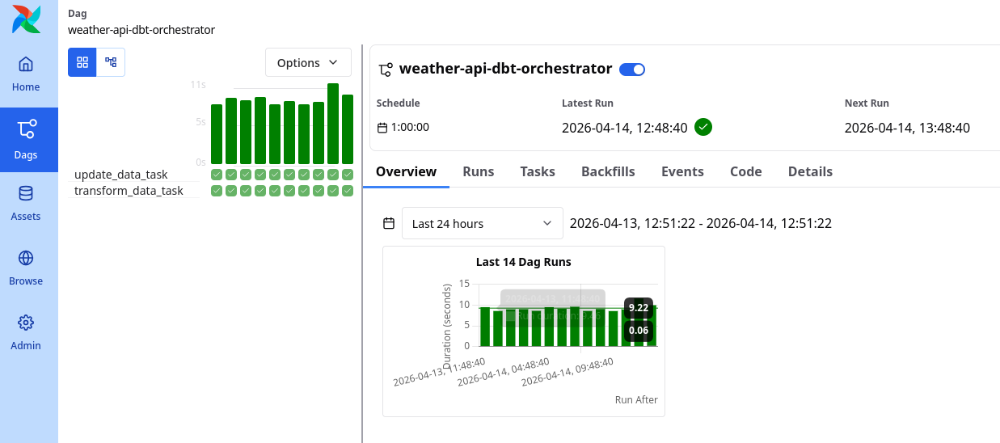
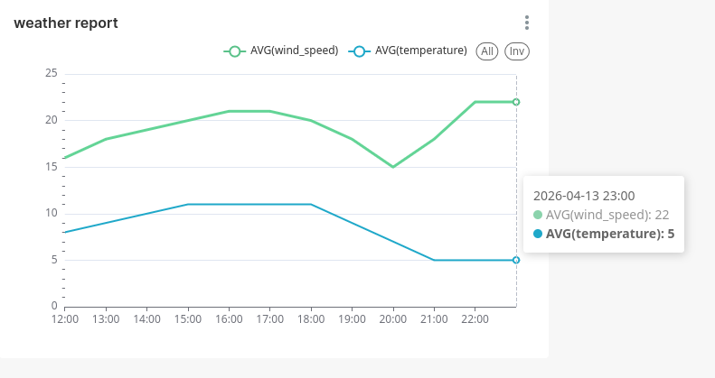

# 🚀 dbt + Airflow Data Pipeline Project

## 📌 Overview
This project is an end-to-end data pipeline that collects weather data from the **Weatherstack API**, processes it using **dbt**, orchestrates workflows with **Apache Airflow**, stores data in **PostgreSQL**, and visualizes insights in **Apache Superset**.

It enables:
- Automated data ingestion and transformation
- Scalable ELT workflows
- Modular and testable SQL transformations
- Fast, interactive analysis of large-scale datasets

---

## 🏗️ Architecture
    +------------------+
    | Data Source      |
    | WeatherStack API |
    +------------------+
           |
           v
    +-------------+
    | Ingestion   |
    | (Python/API)|
    +-------------+
           |
           v
    +-------------------+
    | Data Warehouse    |
    | (PostgreSQL)      |
    +-------------------+
           |
           v
    +-------------+
    | dbt         |
    | Transform   |
    +-------------+
           |
           v
    +-------------+
    |  Analytics  |
    |  Superset   |
    +-------------+

    Orchestrated by Airflow

---

## 🧰 Tech Stack

- **Data Source:** Weatherstack API  
- **Orchestration:** Apache Airflow  
- **Transformation:** dbt  
- **Database:** PostgreSQL
- **Language:** Python  
- **Visualization:** Superset
- **Containerization:** Docker / Docker Compose  

---

## 🗄️ Data Model (dbt)

All tables are created in the `dev` schema:

| Layer        | Table Name          | Description |
|-------------|-------------------|------------|
| **Raw**     | `raw_weather_data` | Raw data ingested from Weatherstack API |
| **Staging** | `stg_weather_data` | Cleaned and standardized data |
| **Mart**    | `daily_average`    | Aggregated daily weather metrics |
| **Mart**    | `weather_report`   | Final reporting table for analytics |

---


## ⚙️ Setup & Installation

### 1. Clone repository
```bash
git clone https://github.com/Barsh4ec/weather_data_pet_project
cd weather_data_pet_project
```
### 2. Create evironament files and configure variables
```bash
cp .env.example .env  #configure database connection
cp docker/.env.example docker/.env
```
### 3. Start services
```bash
docker compose up -d
```
---
## 🚰 Pipeline Workflow
### 1. Extract
 - Fetch weather data from Weatherstack API
### 2. Load
 - Store raw JSON data into PostgreSQL (`raw_weather_data`)
### 3. Transform (dbt)
 - Clean and normalize data → `stg_weather_data`
 - Aggregate metrics → `daily_average`
 - Build reporting layer → `weather_report`
### 4. Visualize
 - Superset dashboards built on `weather_report`

---
## ▶️ Running the Pipeline

### Open Airflow UI:
 - http://localhost:8080

### Enable weather-api-dbt-orchestrator DAG
 - Trigger DAG manually or wait for schedule


### Create dashboard in Superset

 - 


